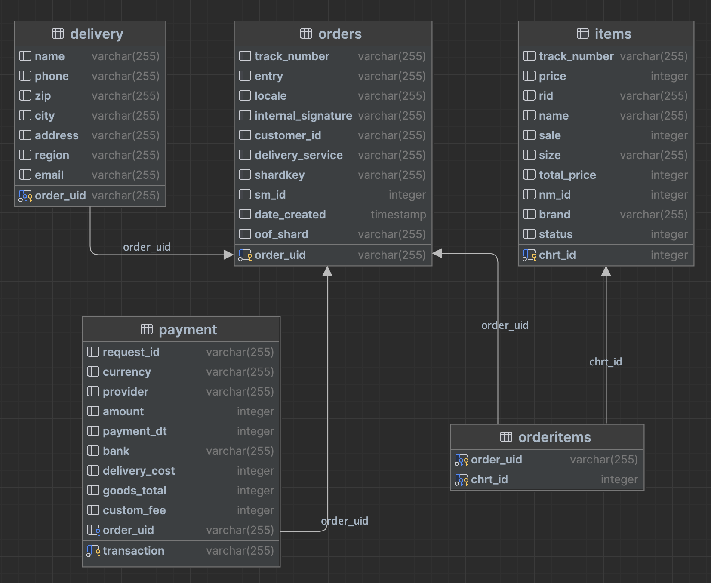
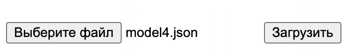

# wb-0

Разработка сервиса работы с json файлами

Author : [Egor Kondratov(mavissig)](https://github.com/mavissig)

---

## Contents

1. [Preamble](#preamble)
2. [Introduction](#introduction)
3. [Information](#information)
4. [About the program](#about-the-program)

## Preamble


Этот образовательный проект фокусируется на разработке демонстрационного сервиса для управления данными о заказах.
Проект использует SQL, NATS Streaming (NATS-Streaming или STAN) и язык программирования Go (Golang) для достижения
своих целей. Основная цель - создать локальный сервис с простым пользовательским интерфейсом для отображения данных
о заказах, следуя предоставленной модели данных в формате JSON.

## Introduction

- Модель данных которые подаются на вход программе выглядит следующим образом:
    
  ```json
            
      {
      "order_uid": "bb25i9bj87n4n6klkl67test",
      "track_number": "TESTTRACK",
      "entry": "GGLIL",
      "delivery": {
          "name": "Test Testov",
          "phone": "+9870000147",
          "zip": "2639809",
          "city": "NSK",
          "address": "Ploshad Lenina 15",
          "region": "SFO",
          "email": "test@gmail.com"
      },
      "payment": {
          "transaction": "bb23bj23n4n6klkl67test",
          "request_id": "",
          "currency": "USD",
          "provider": "bankpay",
          "amount": 1817,
          "payment_dt": 1637907727,
          "bank": "sber",
          "delivery_cost": 1500,
          "goods_total": 317,
          "custom_fee": 0
      },
      "items": [
          {
          "chrt_id": 9934930,
          "track_number": "TESTTRACK",
          "price": 453,
          "rid": "ab4217787a764ae0btest",
          "name": "Matras",
          "sale": 30,
          "size": "0",
          "total_price": 317,
          "nm_id": 2389212,
          "brand": "Vilenne Salo",
          "status": 202
          }
      ],
      "locale": "en",
      "internal_signature": "",
      "customer_id": "test",
      "delivery_service": "lhd",
      "shardkey": "9",
      "sm_id": 99,
      "date_created": "2023-01-24T06:21:17Z",
      "oof_shard": "1"
      }
  ```

- Схема базы данных в программе состоит из пяти таблиц и выглядит следующим образом:
  -  
  - таблица orders хранит информацию о заказах
  - таблица delivery хранит информацию о доставке
  - таблица payment хранит информацию о платеже
  - таблица items хранит информацию о товарах
  - таблица orderitems хранит информацию о заказе и товарах в нем(так как в одном заказе может быть более одного товара)


- Сервис 
  - при запуске сервиса данные из базы данных выгружаются в кэш
  - при запуске сервиса происходит подключение и подписка на Nats-streaming(далее stan) следующих модулей:
    - cache(модуль добавления данных в кэш)
    - database(модуль добавления данных в базу данных)
  - после добавления json файла на `localhost` файл уходит на бэк 
  - в хендлере происходит отправка этого json файла в stan
  - отправленный в stan файл ловят подписанные сервисы(cache, database), эти сервисы добавляют json в кэш и 
  базу данных, соответственно
  - при вытягивании данных на фронт, после хендлера вызывается метод для вытягивания данных из кэша
  - вызывается кэш(реализован синглтоном) и так как кэш реализован через `map`, то по ключу(которым является `order_uid`) 
  мы получаем наш заказ с соответствующими ему таблицами оплаты, доставки и товаров
  - отправляем этот заказ на фронт


- Интерфейс реализован в файле `[PROJ_DIR]/web/index.html` 

## Information

> JSON - это формат обмена данными, основанный на JavaScript. Он легко читается людьми и обрабатывается машинами. JSON 
> состоит из двух структур: объектов и массивов. Объект - это набор пар ключ: значение, заключенный в фигурные скобки. 
> Массив - это упорядоченный список значений, заключенный в квадратные скобки. Значениями могут быть строки, числа, 
> логические значения, null, другие объекты или массивы. JSON поддерживается многими языками программирования и 
> используется для обмена данными между браузером и сервером, а также между разными программными системами.

### Загрузка файлов

- в интерфейсе присутствуют две кнопки для загрузки файла:
  -  
  - в первой мы выбираем файл(стоит ограничения only json)
  - по нажатию на кнопку "загрузить" происходят процессы описаные выше

### Получение файлов

- для получения данных о заказе еть поле для ввода order_uid и кнопка "получить"
  -  


## About the program

- Программа разработана на языке *Go(Golang) 1.21.1*
- Для реализации базы данных использован Postgresql (sqlx + pgx)
- Использовался nats-streaming-server *version 0.25.5*